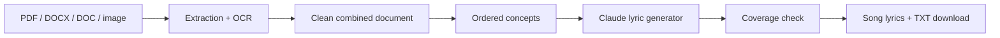

# NoteTune

NoteTune turns student notes into a simple, catchy educational song. Upload
PDF, DOCX/DOC, JPG, or PNG files; text is extracted in upload order, converted
to ordered concepts, sent to Claude for child-friendly lyrics, and checked so
every concept is represented. Without an API key, a deterministic local lyric
generator keeps the demo usable offline.

## Run it

```bash
python -m venv .venv
# Windows: .venv\Scripts\activate
pip install -r requirements.txt
copy .env.example .env
# Put ANTHROPIC_API_KEY in .env to enable Claude (optional for local fallback)
cd backend
python run.py
```

Open `frontend/index.html` in a browser, or serve the frontend with any static
server. The API is at `http://127.0.0.1:8000`; Swagger docs are at `/docs`.
Legacy `.doc` files use the system `antiword` command; saving them as `.docx`
avoids that optional system dependency. Tesseract must also be installed and
available on PATH for image OCR.

## Architecture



`backend/app/extraction.py`, `backend/app/coverage.py`, and
`backend/app/lyrics.py` are independent modules. The API accepts multiple files
and preserves their order and source names. Coverage is keyword-based and
returns each concept's missing keywords so an imperfect model response is
visible rather than silently accepted.

## Test

```bash
python -m pytest -q
```

See `examples/` for demo notes and generated lyrics. Audio generation is
intentionally left as an optional next integration: the current API produces
portable text that can be sent to a TTS or music service.